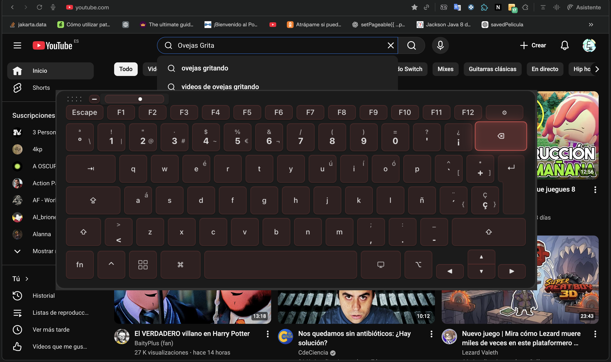
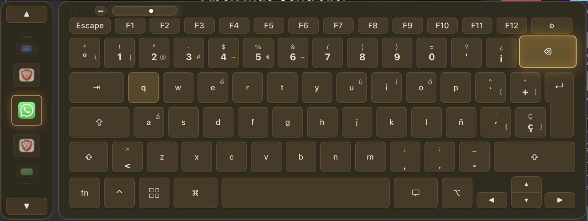
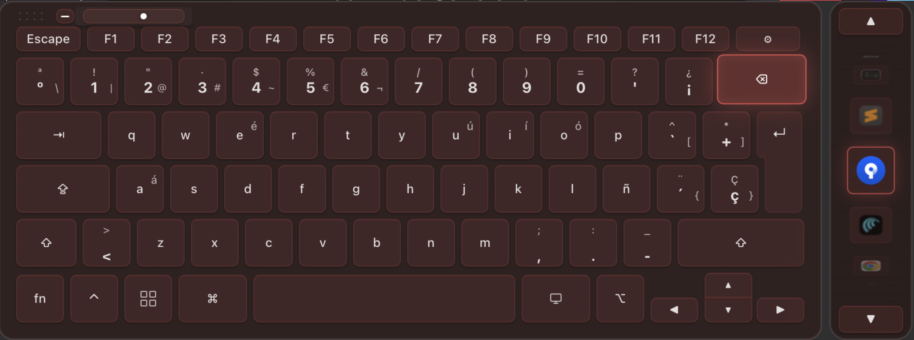
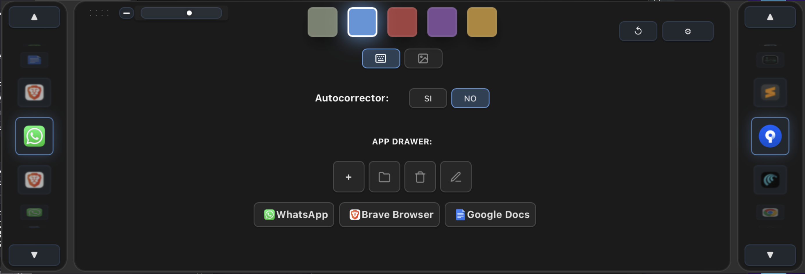
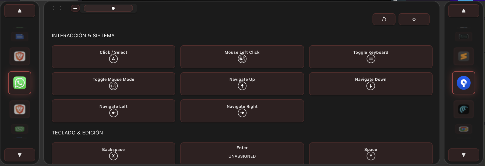
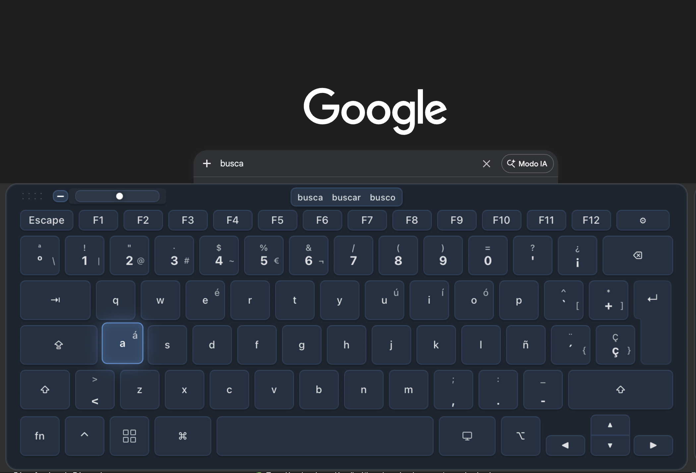
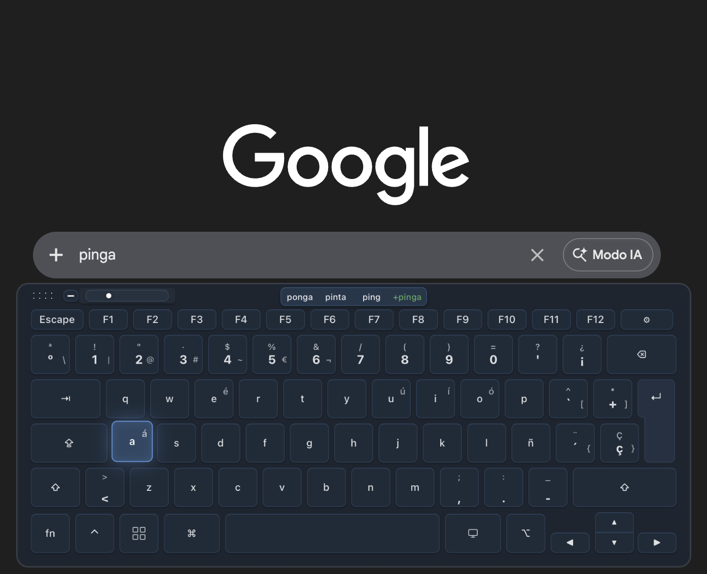

# 🎮 Ovecontroller - [GHOST REPOSITORY]

> [!IMPORTANT]
> This is a **ghost repository**. The source code for this project is **private** for commercial reasons. This space exists solely to showcase the capabilities and design of the software. If you are interested in the code or a collaboration, please contact the author.
> 
> [**Leer en Español 🇪🇸**](README.es.md)

---

**Ovecontroller** is an innovative virtual keyboard designed specifically to be controlled with game controllers (**Xbox, PS4, Joy-Cons**, etc.). Forget the slowness of typing character by character with traditional console systems; **Ovecontroller** allows for fluid, fast, and comfortable typing from your PC interface.

---

## 📸 Gallery

### ⌨️ Keyboard Interface

*Default keyboard view.*

### 🚀 Rapid Access

*Keyboard view with the rapid access bar for your configured apps.*

### 🖥️ System Management

*Visualization of open apps in the system.*

### ⚙️ Settings and Themes

*Menu to change themes and configure autocorrect.*

### 🎮 Control Mapping

*Full control mapping for the controller.*

### 🧠 Autocomplete & Theme Integration

*Final design of the suggestions bar integrated with the keyboard theme.*

### ➕ Personal Dictionary

*Ability to add new words not in the dictionary.*

---

## ✨ Features

- **🎮 Controller Support**: Compatible with major controllers via optimized input abstraction.
- **⚡ Fast Typing**: Grid design optimized for analog and digital navigation.
- **🔍 Word Suggestions**: Integrated dictionary that learns from your personalized words.
- **🎨 Themes**: Modern interface with transition effects and interactive carousels.
- **📐 Dynamic Resizing**: Adjust the keyboard size in real-time.
- **🚀 System Integration**: Launch apps and manage window focus automatically.

---

*Made with ❤️ by [Oveja](https://github.com/JoelBeja2000)*
